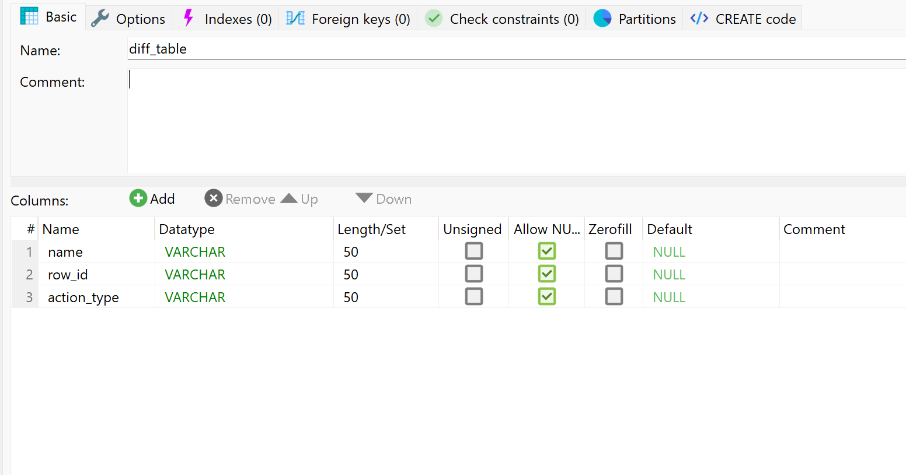

# Source Discovery Tool

This repository provides simple scripts to compare two Moodle databases and identify any structural or data differences.  
It is designed for administrators and developers who want to detect changes made to a Moodle database, such as after upgrades, manual edits, or migrations.

---

## Features

- Compare the structure and data between two Moodle databases.
- Generate detailed reports of changed, inserted, and deleted rows.
- Write all detected differences to a dedicated difference database for review.
- Includes batch and Python scripts for automating both backup/restore and comparison.

---

## Getting Started

You will need:
- Your main Moodle database (original, unchanged)
- The backup/restore script will automatically create a backup database (for comparison)
- **You must manually create an empty database** for differences (default name: `diff_database`)

---

### Prerequisites

- Python 3.x
- [`mysql-connector-python`](https://pypi.org/project/mysql-connector-python/) (`pip install mysql-connector-python`)
- MySQL/MariaDB server access for all databases
- Permission to create databases and tables

---

### Installation

Clone this repository:
    ```bash
    git clone https://github.com/MiriNajme/Moodle_Database_Comparison.git
    cd Moodle_Database_Comparison
    ```

2. Edit the credentials in `compare_databases.py` for your server setup.

---

## Usage

### Step 1: Create the Difference Database

Before starting, **create an empty database** (default: `diff_database`) where the differences will be stored.  
You can do this in MySQL with:
```sql
CREATE DATABASE diff_database;
```
Add a new table to the `diff_database` as shown in the figure below:
  


### Step 2: Run the Backup/Restore Script

Open your terminal and navigate to the folder containing the script (/Source-Discovery-Tool), then run:

```bash
python moodle_backup_restore.py
```
#### Respond to the Prompts

- **Default Configuration:**  
  The tool will display default settings (host, username, password, source database, backup path, destination database, etc.).
  - When asked:  
    `Would you like to use the default configuration? [Y/n]:`  
    - Type `n` to enter your own details, or just press `Enter` (or type `y`) to use the defaults.

- **For Each Prompt:**  
  For each of the following, either press `Enter` to accept the default value in brackets, or type your custom value:
  - **Enter host [localhost]:**  
  Database server address. Press `Enter` for local computer or type another address if needed.
- **Enter username [root]:**  
  MySQL username. Press `Enter` for `root` or type your username.
- **Enter password [empty]:**  
  MySQL password. Press `Enter` if none, or type your password.
- **Enter source database [moodle]:**  
  Name of your original Moodle database. Press `Enter` for `moodle` or type a different name.
- **Destination database:**  
  Enter the name you want for your backup database (e.g., `moodle_backup`), or press `Enter` to use the default name.
- **Backup file path:**  
  Enter the full path to where you want to store the `backup.sql` file.
- **MySQL binary folder:**  
  Enter the path to the `bin` folder of your MySQL installation (e.g., ` C:\Moodle5.1\server\mysql\bin` or as shown by your Moodle installer).

- **Backup Step:**  
  When prompted:  
  `Would you like to create a backup from 'moodle' database? [y/n]:`  
  - Type `y`.

- **Restore Step:**  
  When prompted:  
  `Would you like to restore backup to 'your_database_name' database? [y/n]:`  
  - Type `y` to proceed with restoring your backup file into the specified backup database.

### Step 3: Make a Change
Make the change you want to track in your main Moodle database.

### Step 4: Run the Comparison Script

To compare your main and backup Moodle databases, run
```bash
python compare_databases.py
```
or the batch file `compare_databases.py`.

## Disclaimer

This tool is provided **as-is**, with no warranty or guarantee of correctness.

**Always back up your data before running any database operation.**


